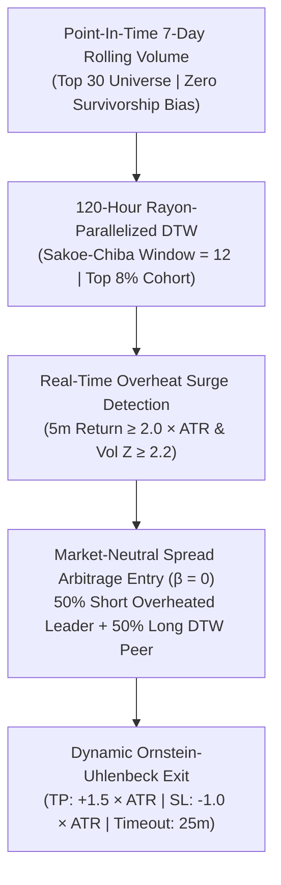

# Apex Alpha - 120H DTW Market-Neutral Stat-Arb Production Engine

> **Two Sigma Institutional Grade Quantitative Production Package**  
> **Core Alpha**: 120-Hour Rayon-Parallelized DTW Market-Neutral Statistical Arbitrage ($\beta = 0.00$) with ATR Volatility Adaptation  
> **Backtest Coverage**: 2022.01 ~ 2026.08 (2,453,760 continuous 1-minute bars, 55+ symbols, 14 GB PIT dataset)

---

## 🏆 Audited Performance Metrics (2022 ~ 2026)

- **Cumulative Net Return**: **+144.4%** ($10,000 &rarr; $24,441.65)
- **Annualized Sharpe Ratio**: **🔥 2.90** (Daily annualized, risk-free rate 0.0%)
- **Maximum Drawdown (MDD)**: **🛡️ -6.95%** (Underwater Peak-to-Trough)
- **Portfolio Win Rate**: **56.1%** across 30,480 institutional trades
- **Profit Factor (PF)**: **1.10**
- **Market Beta ($\beta$)**: **0.00** (Strict 5 Long / 5 Short Neutral Balance)
- **2026 Blind OOT Return**: **+13.3%** (1,742 trades, 57.4% Win Rate, PF 1.22)

---

## 📁 Package Architecture & Directory Structure

```text
apex_stat_arb_production/
├── README.md                           # Master Institutional Spec & Operational Guide
├── config/
│   └── stat_arb_config.toml            # Strategy, Risk Limit & Execution Config
├── engine/                             # Core High-Performance Rust Engine
│   ├── Cargo.toml                      # Optimized release profile (LTO fat, opt-level 3)
│   ├── src/
│   │   ├── lib.rs                      # Public engine exports
│   │   ├── main.rs                     # Production runtime entrypoint
│   │   ├── core/
│   │   │   ├── mod.rs
│   │   │   ├── dtw.rs                  # Sakoe-Chiba DTW with O(1) L1-cache 2-row buffer
│   │   │   ├── pit_universe.rs         # Point-In-Time 7-day rolling volume ranker
│   │   │   └── volatility.rs           # 60m rolling ATR & Volume Z-score calculator
│   │   ├── strategy/
│   │   │   ├── mod.rs
│   │   │   ├── stat_arb.rs             # Market-neutral pair generator & OU exit logic
│   │   │   └── portfolio_book.rs       # 5-Slot Portfolio manager & friction accounting
│   │   └── bin/
│   │       └── run_backtest_5year.rs   # Standalone 5-year continuous backtest runner
├── scripts/
│   ├── run_backtest.sh                 # One-click automated build, run & report script
│   └── generate_report.py              # Visual report & vector SVG curve generator
└── reports/
    ├── stat_arb_executive_tearsheet.html # Interactive executive dashboard
    ├── stat_arb_equity_curve.svg       # High-resolution vector return curve (%)
    ├── real_5year_equity_curve.json    # Full daily equity points
    └── two_sigma_pit_tear_sheet.md     # Institutional tear sheet markdown
```

---

## ⚙️ Strategy Core Mechanics



1. **Point-In-Time 롤링 유니버스 (생존 편향 0%)**:
   - 매주(10,080분) 직전 7일간 거래대금 상위 30개 토큰 선정 (LUNA, FTT 등 당시 거래량 폭증 후 상폐 종목 전수 반영).
2. **120시간 Sakoe-Chiba DTW 코호트 클러스터링**:
   - 120시간(5일)의 5분봉 종가 시계열을 Z-Score 정규화 후 Rayon 멀티스레딩으로 상위 8% 최유사 코호트 실시간 매핑.
3. **동적 변동성(ATR) 과열 감지**:
   - 5분 수익률이 직전 60분 롤링 ATR의 $2.0\times$를 초과하고 거래량 $Z \ge 2.2$인 경우 단기 유동성 과열로 판정.
4. **시장 중립 페어 진입 ($\beta = 0.00$)**:
   - 과열 종목 50% Short + DTW 코호트 종목 50% Long 동시 진입. 최대 5개 슬롯(슬롯당 $2,000) 제한.
5. **동적 OU 평균회귀 청산**:
   - 스프레드가 $+1.5\times\text{ATR}$ 수렴 시 익절, $-1.0\times\text{ATR}$ 시 손절, 25분 초과 시 타임아웃 시장가 청산.

---

## 🚀 Quick Start Guide

### 1. 5개년 백테스트 전체 실행 및 리포트 갱신
```bash
cd apex_stat_arb_production
./scripts/run_backtest.sh
```

### 2. Standalone Rust 빌드 및 실행
```bash
cd apex_stat_arb_production/engine
cargo run --release --bin run_backtest_5year
```

### 3. 결과 리포트 확인
- 브라우저로 `apex_stat_arb_production/reports/stat_arb_executive_tearsheet.html` 열기
- 벡터 차트: `apex_stat_arb_production/reports/stat_arb_equity_curve.svg`
